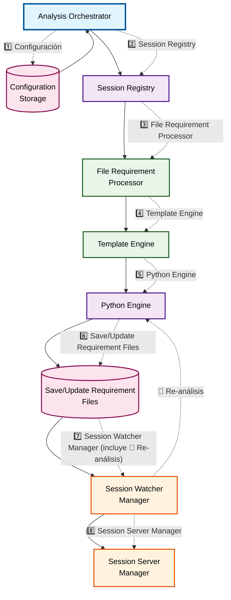

# Arquitectura del Subsistema de Análisis - Code-XR

## Diagrama en Mermaid

## Descripción de Componentes

### Control Layer
- **Analysis Orchestrator**: Coordina el proceso completo desde solicitud hasta visualización

### Core Processing
- **Session Registry**: Registro centralizado de sesiones activas con estado y configuración
- **Python Engine**: Extrae métricas del código fuente mediante bibliotecas especializadas

### File & Template Processing
- **File Requirement Processor**: Prepara archivos necesarios (plantillas HTML, scripts JS/CSS, datos)
- **Template Engine**: Combina plantillas con datos de análisis y configuraciones visuales

### Service Management
- **Session Watcher Manager**: Gestiona observadores de archivos para re-análisis automáticos
- **Session Server Manager**: Controla servidores HTTP y canales SSE

### Persistence
- **Configuration Storage**: Almacena configuraciones, preferencias y perfiles de usuario

## Flujo de Datos

1. **Control**: Analysis Orchestrator coordina todo el proceso
2. **Registro**: Session Registry gestiona el ciclo de vida de las sesiones
3. **Análisis**: Python Engine extrae métricas del código
4. **Procesamiento**: File Requirement Processor prepara recursos
5. **Plantillas**: Template Engine combina datos con visualizaciones
6. **Monitoreo**: Session Watcher Manager observa cambios de archivos
7. **Servidor**: Session Server Manager sirve las visualizaciones
8. **Persistencia**: Configuration Storage mantiene configuraciones

## Notas sobre el Diagrama

- Las líneas sólidas (`-->`) representan flujo de control principal
- Las líneas punteadas (`-.->`) representan comunicación de eventos/feedback
- Los colores diferenciados ayudan a identificar los tipos de componentes:
  - Gris: Componentes generales
  - Azul: Managers de servicios
  - Verde: Motores de procesamiento
  - Naranja: Almacenamiento
