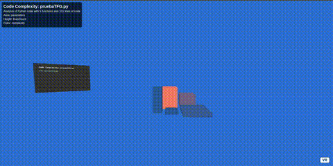

# CodeXR — Code Visualization in Extended Reality

Visual Studio Code extension that transforms your code analysis into immersive XR visualizations. Experience your code metrics (complexity, lines, parameters) in both traditional VS Code views and breathtaking XR/VR environments powered by BabiaXR and A-Frame 1.7.1. **The primary intended use is in AR mode, bringing your code's structure into your physical workspace.**

Gain unprecedented insights into your codebase by stepping into a XR representation of your code structure that updates in real-time as you work.

[](https://opensource.org/licenses/MIT)
[](https://marketplace.visualstudio.com/items?itemName=aMonteSl.code-xr)
[](https://marketplace.visualstudio.com/items?itemName=aMonteSl.code-xr)
[](https://marketplace.visualstudio.com/items?itemName=aMonteSl.code-xr)
[](https://aframe.io/)
[](https://immersiveweb.dev/)
[](https://babiaxr.gitlab.io/)
[](https://code.visualstudio.com/)
[](https://letsencrypt.org/)


## Primary Feature: Immersive Code Visualization

CodeXR's main purpose is to provide powerful, interactive 3D visualizations of your code:

- 🥽 **XR Visualization** - Explore your code metrics in immersive VR/AR environments with universal controller support
- 🔄 **Live Updates** - See your code changes reflected instantly in the visualization without page refresh
- 🎨 **Multi-dimensional Mapping** - View multiple metrics simultaneously with customizable mappings:
  - Function parameters represented by area, height, or depth
  - Lines of code shown through any dimension
  - Complexity illustrated with color gradients from multiple palettes
  - Interactive dimension configuration for different perspectives
- 📊 **BabiaXR Integration** - Leverage advanced 3D data visualization with multiple chart types
- 🎮 **Universal Controller Support** - Works with all major VR headsets (Oculus, Valve Index, HTC Vive, etc.)



## How to Use Visualizations

### Quick Start with XR Visualization

1. Right-click on a file in VS Code Explorer
2. Select "CodeXR Analyze File: XR"
3. A browser will open showing your 3D code visualization
4. Edit your code - watch as the visualization updates in real-time!
5. **For AR mode**: Access the visualization URL on your AR-capable device to overlay code metrics in your physical environment

### Visualization Modes

| Mode | Description | Best For |
|------|-------------|----------|
| **AR Mode** | Overlay on physical world with `hide-on-enter-ar` optimization | **Primary intended use** - Integrating code insights into your workspace |
| VR Mode | Full immersive experience with joystick navigation | Deep code structure exploration with natural movement |
| Desktop 3D | Standard browser view with mouse controls | Quick analysis without headset |

### VR/AR Navigation

- **Left Joystick**: Natural locomotion and movement
- **Right Joystick**: Smooth rotation controls
- **Hand Tracking**: Gesture-based interaction (supported devices)
- **Room-scale**: Full room tracking support
- **Cross-platform**: Universal compatibility with all major VR systems

### AR Mode Benefits

The AR visualization is designed to:
- Blend your code metrics with your physical development environment
- Enable hands-free code exploration while you continue working
- Facilitate team discussions with shared AR views of code structure
- Provide spatial understanding of complex codebases with optimized AR rendering

### Visualization Settings

Customize your visualization experience through the CodeXR tree view:

- **Environment Themes** - Forest, Dream, Arches, City, Space, and more
- **Color Palettes** - Blues, Business, Commerce, Flat, Foxy, and other visualization schemes
- **Chart Types** - Bars, cylinders, bubbles, donuts, boats and other BabiaXR visualizations
- **Background and Ground Colors** - Real-time color customization with live preview
- **Dimension Mapping** - Choose what metrics map to X, Y, Z axes and additional properties
- **Reset to Defaults** - One-click restoration of optimal settings

## Additional Features

### Code Analysis

CodeXR provides comprehensive code analysis across multiple languages:

- 🔍 Multi-language support (JavaScript, TypeScript, Python, C, C++, C#, Vue.js, Ruby)
- 📏 Metrics include lines of code, comments, complexity, function parameters
- ⚡ Configurable analysis timing with visible debounce delay indicator
- 🔄 Auto-analysis toggle with smart file watching
- 📊 Multiple analysis modes (Static, XR) with persistent preferences

### Live Development Experience

- **Real-time Updates**: Server-Sent Events (SSE) for immediate visualization refresh
- **Smart File Watching**: Debounced file monitoring with configurable delays
- **Cache Busting**: Automatic timestamp management for fresh data loading
- **Error Recovery**: Robust error handling with helpful user feedback
- **Port Management**: Intelligent port allocation and cleanup

### Visualization Options

- 📊 **Static Mode** - Traditional webview visualization for quick reference
- 🔍 **Function Detail View** - Drill down into specific function metrics
- 📁 **Multi-File Analysis** - Compare metrics across multiple files
- 🎨 **Dynamic Chart Types** - Switch between visualization types without server restart
- ⚙️ **Persistent Settings** - User preferences saved across VS Code sessions

## Technical Details

### Technologies Used

- **BabiaXR** - Advanced data visualization in XR environments
- **A-Frame 1.7.1** - Latest WebXR framework with enhanced performance and stability
- **TypeScript** - Main development language with enhanced type safety
- **Python/Lizard** - Advanced code metrics and analysis
- **SSE (Server-Sent Events)** - Real-time communication for live updates
- **WebXR APIs** - Universal controller and hand tracking support
- **Express.js** - High-performance local server with live reload

### Architecture

```
CodeXR Extension Architecture
├── 📁 src/
│   ├── 🎮 analysis/                    # Code Analysis Engine
│   │   ├── analysisManager.ts          # Core analysis orchestration
│   │   ├── fileWatchManager.ts         # Real-time file monitoring with debouncing
│   │   ├── analysisDataManager.ts      # Data persistence and caching
│   │   ├── model.ts                    # Analysis data models and types
│   │   └── 🔮 xr/                      # XR-Specific Analysis
│   │       ├── xrAnalysisManager.ts    # XR visualization creation and management
│   │       ├── xrDataTransformer.ts    # Analysis data to XR format conversion
│   │       ├── xrDataFormatter.ts      # BabiaXR-compatible data formatting
│   │       └── xrTemplateUtils.ts      # HTML template generation with A-Frame 1.7.1
│   │
│   ├── 🌐 server/                      # Local Server Infrastructure
│   │   ├── serverManager.ts            # Multi-server lifecycle management
│   │   ├── liveReloadManager.ts        # SSE-based real-time updates
│   │   ├── requestHandler.ts           # HTTP/HTTPS request processing
│   │   ├── certificateManager.ts       # SSL certificate management for WebXR
│   │   ├── portManager.ts              # Intelligent port allocation and tracking
│   │   └── 📡 models/
│   │       └── serverModel.ts          # Server configuration and state models
│   │
│   ├── 🎨 babiaxr/                     # BabiaXR Integration Layer
│   │   ├── babiaTemplateGenerator.ts   # Dynamic BabiaXR template creation
│   │   ├── babiaExampleManager.ts      # Example visualization management
│   │   ├── environmentManager.ts       # XR environment and theme management
│   │   └── 🎯 examples/                # Pre-built BabiaXR Examples
│   │       ├── bar-chart/              # 3D bar chart visualizations
│   │       ├── pie-chart/              # 3D pie chart examples
│   │       ├── cylinder-chart/         # Cylindrical data representations
│   │       └── bubble-chart/           # Bubble chart visualizations
│   │
│   ├── 🖥️ ui/                          # User Interface Components
│   │   ├── treeViewProvider.ts         # VS Code tree view for server management
│   │   ├── statusBarManager.ts         # Status bar integration with debounce indicator
│   │   ├── analysisTreeProvider.ts     # Analysis configuration tree view
│   │   └── webViewManager.ts           # Static analysis webview management
│   │
│   ├── 🐍 pythonEnv/                   # Python Environment Management
│   │   ├── pythonSetup.ts              # Automatic Python environment setup
│   │   ├── dependencyManager.ts        # Python package dependency management
│   │   └── lizardAnalyzer.ts           # Lizard-based code metrics extraction
│   │
│   ├── ⚙️ commands/                    # VS Code Command Handlers
│   │   ├── analysisCommands.ts         # File analysis command implementations
│   │   ├── serverCommands.ts           # Server management commands
│   │   ├── babiaCommands.ts            # BabiaXR-specific commands
│   │   └── settingsCommands.ts         # Configuration management commands
│   │
│   └── 📊 analysis-providers/          # Language-Specific Analysis
│       ├── javascriptAnalyzer.ts       # JavaScript/TypeScript analysis
│       ├── pythonAnalyzer.ts           # Python code analysis
│       ├── cAnalyzer.ts                # C/C++ analysis support
│       └── multiLanguageAnalyzer.ts    # Unified multi-language interface
│
├── 🎨 resources/                       # Extension Resources
│   ├── icons/                          # VS Code command and tree view icons
│   ├── templates/                      # HTML and A-Frame templates
│   └── certificates/                   # Default SSL certificates for WebXR
│
└── 📦 out/                            # Compiled TypeScript Output
    └── extension.js                    # Main extension entry point
```

### Data Flow Architecture

```
📝 Code Change Detection
    ↓ (File Watcher with Debouncing)
🔍 Multi-Language Analysis
    ↓ (Language-specific Analyzers)
📊 Data Transformation
    ↓ (XR Data Formatters)
🔄 Real-time Updates
    ↓ (SSE Communication)
🎮 XR Visualization
    ↓ (BabiaXR + A-Frame 1.7.1)
👁️ Immersive Experience
```

### Key Architectural Features

- **🔄 Event-Driven Updates**: SSE-based real-time communication eliminates polling overhead
- **🎯 Smart Port Management**: Automatic port allocation with conflict resolution
- **📦 Modular Design**: Separation of concerns with clear interfaces between components
- **🔧 Extensible Analysis**: Plugin-based architecture for adding new language support
- **⚡ Performance Optimized**: Debounced file watching and efficient data transformation
- **🛡️ Error Resilient**: Comprehensive error handling with graceful degradation
- **🔒 Security First**: HTTPS support with certificate management for WebXR compatibility

## Usage Notes

- First-time setup automatically configures Python environment
- XR visualizations require a WebXR-compatible browser (Chrome, Edge, Firefox Reality)
- AR mode works best on mobile devices or supported headsets
- Visualizations update in real-time as you edit code with configurable debounce delays
- HTTPS mode required for VR/AR functionality on most devices
- Universal controller support works with all major VR headsets out of the box


## Performance Tips

- Use HTTP mode for faster local development (VR/AR requires HTTPS)
- Adjust debounce delay based on file size and system performance
- Disable auto-analysis for very large files to improve responsiveness
- Close unused analysis servers to free system resources

## Contributing

We welcome contributions! Areas of interest:
- New language analyzers
- Additional BabiaXR chart types
- Enhanced VR/AR interactions
- Performance optimizations

## License

This project is licensed under the MIT License - see the LICENSE file for details.