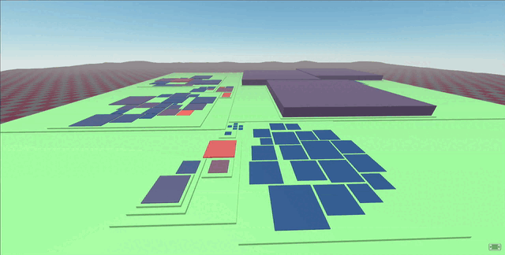
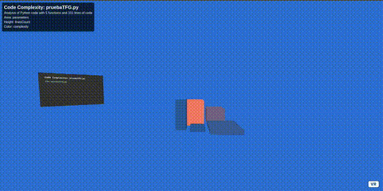

# Code-XR — Code Visualization in Extended Reality (v1.0.0)

A revolutionary Visual Studio Code extension that transforms your code analysis into immersive XR visualizations. Experience your code metrics (complexity, lines, parameters) in both traditional VS Code panels and breathtaking XR/VR environments powered by BabiaXR and A-Frame. Dive deep into your codebase with comprehensive file analysis, directory scanning, and interactive DOM visualization.

**Gain unprecedented insights into your codebase by stepping into an XR representation of your code structure that updates in real-time as you work.**

[](https://opensource.org/licenses/MIT)
[](https://marketplace.visualstudio.com/items?itemName=aMonteSl.code-xr)
[]
[](https://marketplace.visualstudio.com/items?itemName=aMonteSl.code-xr)
[](https://aframe.io/)
[](https://webxr.org/)
[](https://babiaxr.gitlab.io/)
[](https://code.visualstudio.com/)
[](https://developer.mozilla.org/en-US/docs/Web/Security/Secure_Contexts)
[](https://nodejs.org/)
[](https://www.python.org/)
[](https://amontesl.github.io/code-xr-docs/)

## Official Documentation

**Visit our comprehensive documentation website: [https://amontesl.github.io/code-xr-docs/](https://amontesl.github.io/code-xr-docs/)**

Our official documentation includes:
- **Complete Installation Guide** - Step-by-step setup instructions
- **Interactive Tutorials** - Hands-on learning experiences  
- **API Reference** - Detailed technical documentation
- **Video Guides** - Visual walkthroughs of key features
- **Troubleshooting** - Solutions to common issues
- **Advanced Configuration** - Customization options and settings

*You can also access the documentation directly from VS Code through the CodeXR tree view → "Learn More" section.*

## Visual Demonstrations

### 📸 Live Examples - See CodeXR in Action

Experience CodeXR's powerful analysis capabilities through these real-world demonstrations:

#### Project Analysis Examples
<div align="center">

| **BabiaXR Project Analysis** | **Express.js Project Analysis** |
|:---:|:---:|
|  |  |
| *Directory analysis of BabiaXR project (77 files)* | *Directory analysis of Express.js project (142 files)* |

| **JetUML Project Analysis** | **Single File Analysis** |
|:---:|:---:|
|  |  |
| *Directory analysis of JetUML project (338 files)* | *Simple file analysis demonstration* |

</div>

### 🎥 Video Tutorials - Complete Learning Experience

Comprehensive video guides to master every aspect of CodeXR. **Click on any video thumbnail to watch on YouTube:**

#### Core Interface & Features
<div align="center">

**Complete UI Tutorial - Master the entire CodeXR interface and workflow**

[](https://www.youtube.com/watch?v=KRgLdLZJXHA "Complete UI Tutorial - Master the entire CodeXR interface and workflow")

*Click to watch: Complete interface walkthrough and workflow demonstration*

</div>

#### File Analysis Workflows

**File Analysis - LivePanel Mode & XR Mode**

<div align="center">

| **LivePanel Mode** | **XR Mode** |
|:---:|:---:|
| [](https://www.youtube.com/watch?v=n5ZcjlR4pPc "File Analysis - LivePanel Mode") | [](https://www.youtube.com/watch?v=38jGwFGORvc "File Analysis - XR Mode") |
| *Analyze files using LivePanel (right-click & UI methods)* | *Immersive 3D file analysis in extended reality* |

</div>

**DOM Visualization - Interactive HTML structure analysis**

<div align="center">

[](https://www.youtube.com/watch?v=110b-AergdU "DOM Visualization - Interactive HTML structure analysis")

*Click to watch: Interactive DOM tree exploration and analysis*

</div>

#### Directory & Project Analysis

**Directory Analysis - LivePanel & XR Mode**

<div align="center">

| **LivePanel Mode** | **XR Mode** |
|:---:|:---:|
| [](https://www.youtube.com/watch?v=sPWjcgV-gZQ "Directory Analysis - LivePanel Mode") | [](https://www.youtube.com/watch?v=TnfS2SevtWU "Directory Analysis - XR Mode") |
| *Comprehensive directory analysis with detailed metrics* | *3D directory visualization in immersive environments* |

</div>

**Project Analysis - Both LivePanel and XR Modes**

<div align="center">

[](https://www.youtube.com/watch?v=NluAHe3BQu8 "Project Analysis - Both LivePanel and XR Modes")

*Click to watch: Complete project analysis demonstration*

</div>

#### Advanced AR/VR Experiences

<div align="center">

**AR Programming Experience - Real-world augmented reality coding**

[](https://www.youtube.com/watch?v=d7fojpP90Dk "AR Programming Experience - Real-world augmented reality coding")

*Click to watch: Immersive AR programming experience demonstration*

</div>

*These video tutorials provide hands-on demonstrations of every CodeXR feature. Click any thumbnail to watch the full tutorial on YouTube.*

## Quick Start Guide

### Get Started in 30 Seconds

#### Method 1: From Explorer (Right-Click)
1. **Right-click any file** in VS Code Explorer
2. Choose your analysis mode:
   - **"CodeXR: Analyze File (LivePanel)"** - Detailed metrics panel
   - **"CodeXR: Analyze File (XR)"** - Immersive 3D visualization
   - **"CodeXR: Visualize DOM"** - HTML structure analysis (HTML files only)

#### Method 2: From Tree View
1. Open the **CodeXR tree view** in VS Code sidebar
2. Expand **"Project Structure"** section
3. **Click on any file** to analyze it (respects your configuration preferences)
4. HTML files automatically open DOM visualization
5. Other files use your preferred mode (LivePanel or XR)

#### Method 3: From Command Palette
1. Press **Ctrl+Shift+P** (Windows/Linux) or **Cmd+Shift+P** (macOS)
2. Type **"CodeXR"** to see all available commands
3. Select your preferred analysis mode

#### Directory Analysis
1. **Right-click any folder** in the Explorer
2. Choose your analysis mode:
   - **"CodeXR: Analyze Directory (LivePanel)"** - Standard directory analysis
   - **"CodeXR: Analyze Directory (XR)"** - 3D directory visualization
   - **"CodeXR: Analyze Directory (LivePanel Deep)"** - Recursive subdirectory analysis
   - **"CodeXR: Analyze Directory (XR Deep)"** - Recursive 3D analysis with subdirectories

## Understanding Your Results

### LivePanel Analysis Features
- **Function List**: Sortable table with complexity, lines of code, and parameter counts
- **Complexity Distribution**: Visual charts showing complexity patterns across your codebase
- **Cyclomatic Density**: Advanced complexity metrics per function
- **Drill-down Details**: Click any function for detailed analysis and code navigation
- **Aggregated Metrics**: Directory and project-level summaries
- **Export Capabilities**: Save analysis results for documentation and reporting

### XR Visualization Features
- **3D Charts**: Bars, cylinders, bubbles showing function metrics in immersive 3D space
- **Interactive Navigation**: VR controller support or mouse/keyboard controls
- **Real-time Updates**: Changes in your code immediately reflect in the visualization
- **Customizable Mapping**: Choose what metrics map to X, Y, Z dimensions and colors
- **Spatial Understanding**: Visualize code complexity relationships in 3D space
- **Multi-file Visualization**: See entire directories and projects in XR

### DOM Visualization Features
- **Interactive Tree**: Click to expand/collapse DOM elements
- **Element Details**: View attributes, content, and hierarchy information
- **Visual Hierarchy**: Clear parent-child relationships in tree structure
- **Real-time Updates**: See DOM changes as you edit HTML files

## What's New in v1.0.0 - Production Ready Release

### Major Release Highlights - Version 1.0.0
- **Enhanced Dimension Filtering**: Improved chart dimension mapping to exclude string-based fields (filePath, relativePath) from numeric chart dimensions for cleaner visualizations
- **Auto-Analysis Toggle**: Auto-Analysis enabled/disabled configuration with persistence and watcher control
- **Advanced Session Management**: Duplicate session detection and prevention with user notifications and clean analysis flow
- **Smart HTML File Filtering**: Enhanced XR directory analysis to filter HTML files while maintaining full HTML support in LivePanel mode
- **Official Documentation Website**: Launch of comprehensive documentation at [https://amontesl.github.io/code-xr-docs/](https://amontesl.github.io/code-xr-docs/)
- **Enhanced Learn More Section**: Direct access to documentation and tutorials from within VS Code
- **Configuration Restructuring**: Improved settings organization with nested auto-analysis configuration
- **Production Stability**: Comprehensive testing and optimization for production use

### Previous Major Features (v0.0.9)
- **Complete Architecture Overhaul**: Redesigned from the ground up for better performance and reliability
- **LivePanel Analysis**: Renamed from "Static Analysis" for better clarity and enhanced functionality
- **Enhanced Directory Analysis**: Complete implementation of directory analysis in all forms (LivePanel and XR)
- **Deep Analysis Support**: Added deep analysis modes for comprehensive subdirectory traversal
- **Project Structure Navigation**: Interactive project browser with click-to-analyze functionality
- **Improved Metrics**: Fixed cyclomatic complexity calculations and added new visualization dimensions
- **Unified Session Management**: Better tracking and management of active analysis sessions

## Analysis Modes Overview

Code-XR offers powerful analysis modes, each optimized for different file types and use cases. **All analysis modes support 25+ programming languages** with comprehensive file, directory, and project analysis capabilities.

### LivePanel Analysis Mode (Formerly Static Analysis)
**Best for:** Detailed metrics review, reporting, and comprehensive code analysis

**Features:**
- Comprehensive function-level analysis with accurate metrics
- Enhanced complexity distribution charts with improved layout
- Cyclomatic density calculations and complexity metrics
- Interactive drill-down panels for detailed function analysis
- Real-time updates as you edit code, directories, and projects
- Export capabilities for reporting and documentation
- Support for both standard and deep analysis modes

### XR Analysis Mode
**Best for:** Immersive code exploration in VR/AR environments

**Features:**
- Immersive 3D visualizations with bars, cylinders, bubbles, and boats
- Real-time updates as you edit code, directories, and projects without exiting VR/AR mode
- Universal VR controller support for all major headsets
- Multi-dimensional metric mapping (complexity, LOC, parameters, file size)
- Customizable environments and color palettes for optimal viewing
- Spatial representation of code complexity and structure
- Support for both standard and deep analysis modes

### DOM Visualization Mode
**Best for:** HTML structure analysis and web development

**Features:**
- Interactive DOM tree exploration with click-to-expand functionality
- Element hierarchy visualization with clear parent-child relationships
- Real-time DOM structure analysis and attribute inspection
- Automatic routing from any analysis command when dealing with HTML files
- Element details including attributes, content, and positioning

## Comprehensive Analysis Capabilities

### Common Analysis Features (All Types)
**Universal capabilities available for files, directories, and projects:**

- **25+ Programming Languages**: Full support for JavaScript, TypeScript, Python, C/C++, C#, Java, Ruby, Go, PHP, Swift, Kotlin, Rust, and many more
- **Cyclomatic Complexity**: Industry-standard complexity calculation using Lizard integration
- **Lines of Code Metrics**: Total lines, code lines, comment lines, and blank lines with language-aware parsing
- **Function Analysis**: Function count, parameter analysis, complexity per function, and cyclomatic density
- **Class Detection**: Object-oriented structure analysis including inheritance, interfaces, and nested classes
- **Comment Analysis**: Language-specific comment detection (single-line, multi-line, documentation)
- **Real-time Updates**: Automatic re-analysis when content changes (applies to all analysis modes: LivePanel, XR, DOM)
- **Multiple Visualization Modes**: Choose between LivePanel (detailed panels), XR (immersive 3D), or DOM (HTML structure)

### File Analysis Specifics
**Individual file deep-dive analysis:**

- **Single File Focus**: Concentrated analysis of one file with detailed function-by-function breakdown
- **Function-level Metrics**: Individual function complexity, parameters, and lines of code
- **Code Navigation**: Direct navigation to specific functions and classes from analysis results
- **Instant Analysis**: Immediate results for quick code quality assessment
- **Export Individual Reports**: Save detailed reports for specific files

### Directory Analysis Specifics
**New in v0.0.9:** Complete directory analysis implementation

- **Batch Processing**: Analyze entire directories with progress tracking and status updates
- **Recursive Scanning**: Deep analysis modes for comprehensive subdirectory traversal (configurable depth)
- **Hierarchical Metrics**: Aggregated complexity and LOC metrics across directory structures
- **Smart File Detection**: Automatic identification and filtering of analyzable files by extension
- **Directory-level Reporting**: Combined metrics showing directory complexity distribution
- **Subdirectory Comparison**: Compare complexity across different subdirectories
- **Large Directory Optimization**: Efficient processing of directories with hundreds of files
- **Selective Analysis**: Option to exclude certain subdirectories or file patterns

### Project Analysis Specifics
**Workspace-wide comprehensive analysis:**

- **Workspace-wide Scanning**: Analyze entire VS Code workspaces including all folders and subprojects
- **Cross-language Metrics**: Combined complexity metrics across different programming languages
- **Project Architecture Insights**: Understand overall project complexity distribution and hotspots
- **Language Distribution Analysis**: See what percentage of your project is in each programming language
- **Project-level Aggregation**: Total lines of code, functions, classes, and complexity across entire project
- **Comprehensive Reporting**: Detailed analysis reports covering entire project structure and complexity
- **Large Project Optimization**: Optimized for analyzing projects with thousands of files

## Supported Languages

Code-XR provides comprehensive analysis for 25+ programming languages through advanced Lizard integration:

### Complete Language Support Matrix

| Language | Extensions | Analysis Types | Comment Detection | Class Detection |
|----------|------------|----------------|-------------------|-----------------|
| **JavaScript** | .js, .jsx, .mjs, .cjs | LivePanel, XR | C-style (//, /* */) | ES6 Classes |
| **TypeScript** | .ts, .tsx | LivePanel, XR | C-style (//, /* */) | Classes & Interfaces |
| **Python** | .py, .pyw, .pyi | LivePanel, XR | Hash (#) + Docstrings | Classes & Methods |
| **C/C++** | .c, .cpp, .cc, .cxx, .h, .hpp, .hxx | LivePanel, XR | C-style (//, /* */) | Classes & Structs |
| **C#** | .cs | LivePanel, XR | C-style (//, /* */) | Classes & Namespaces |
| **Java** | .java | LivePanel, XR | C-style (//, /* */) | Classes & Interfaces |
| **Ruby** | .rb, .rbw | LivePanel, XR | Hash (#) + Block (=begin/=end) | Classes & Modules |
| **Go** | .go | LivePanel, XR | C-style (//, /* */) | Structs & Interfaces |
| **PHP** | .php, .phtml, .php3, .php4, .php5 | LivePanel, XR | C-style + Hash (//, #, /* */) | Classes & Traits |
| **Swift** | .swift | LivePanel, XR | C-style (//, /* */) | Classes & Structs |
| **Kotlin** | .kt, .kts | LivePanel, XR | C-style (//, /* */) | Classes & Objects |
| **Rust** | .rs | LivePanel, XR | C-style (//, /* */) | Structs & Impl |
| **Scala** | .scala, .sc | LivePanel, XR | C-style (//, /* */) | Classes & Objects |
| **Lua** | .lua | LivePanel, XR | Double dash (--) | Table-based OOP |
| **Erlang** | .erl, .hrl | LivePanel, XR | Percent (%) | Modules |
| **Zig** | .zig | LivePanel, XR | C-style (//) | Structs |
| **Perl** | .pl, .pm, .pod, .t | LivePanel, XR | Hash (#) | Packages |
| **Solidity** | .sol | LivePanel, XR | C-style (//, /* */) | Contracts |
| **TTCN-3** | .ttcn, .ttcn3 | LivePanel, XR | C-style (//, /* */) | Modules |
| **Objective-C** | .m, .mm | LivePanel, XR | C-style (//, /* */) | Classes & Categories |
| **Fortran** | .f90, .f95, .f03, .f08, .f | LivePanel, XR | Exclamation (!) | Modules & Types |
| **GDScript** | .gd | LivePanel, XR | Hash (#) | Classes |
| **Vue.js** | .vue | LivePanel, XR | HTML (<!-- -->) | Component Analysis |
| **HTML** | .html, .htm, .xhtml | DOM Visualization | HTML Comments | Element Structure |
| **Dart** | .dart | LivePanel, XR | C-style (//, /* */) | Classes |

### Analysis Capabilities by Language

**All Languages Support:**
- Lines of Code (LOC) counting with accurate parsing
- Cyclomatic Complexity analysis using industry-standard algorithms
- Function parameter counting and analysis
- Accurate comment detection with language-specific rules
- Real-time analysis with intelligent file watching
- Multi-file analysis support for batch processing

**Advanced Features:**
- **Comment Analysis**: Language-aware parsing for single-line, multi-line, and documentation comments
- **Class Detection**: Object-oriented structure analysis including inheritance and nested classes
- **Function Metrics**: Parameter counting, complexity scoring, and density calculations
- **File Organization**: Smart sorting and filtering by language in the tree view


## VR/AR Navigation Controls

### VR Controllers
- **Left Joystick**: Move forward/backward/left/right in 3D space
- **Right Joystick**: Rotate view smoothly for comfortable navigation
- **Hand Tracking**: Natural gesture-based interaction (supported devices)
- **Button Mapping**: Universal support for all major VR headsets

### Desktop Controls
- **Mouse**: Click and drag to rotate view around code visualizations
- **WASD Keys**: Navigate through the 3D space like a first-person game
- **Scroll Wheel**: Zoom in and out for detailed or overview perspectives
- **Arrow Keys**: Alternative navigation for fine-tuned movement

## Managing Active Analyses

The **"Active Analyses"** section in the tree view provides comprehensive session management:

- **View Status**: See which files, directories, or projects are currently being analyzed
- **Prevent Duplicates**: Automatically prevents multiple analyses of the same target
- **Quick Access**: Click to reopen existing visualizations
- **Easy Cleanup**: Close analyses you no longer need to free system resources
- **Session Details**: View detailed information about each active analysis
- **Browser Integration**: Open analyses directly in your browser

## Configuration and Customization

### Analysis Settings
Access settings directly from the tree view or VS Code preferences:

- **Default Analysis Mode**: Choose between LivePanel and XR as your default
- **Deep Analysis Settings**: Configure default behavior for directory and project analysis
- **Debounce Timing**: Adjust how quickly analysis responds to code changes
- **Auto-analysis**: Enable/disable automatic re-analysis on file save
- **File Filtering**: Configure which file types to include/exclude from analysis

### XR Environment Settings
Customize your immersive experience:

- **Chart Types**: Bars, cylinders, bubbles, boats, and more visualization options
- **Color Palettes**: Business, Blues, Commerce, Flat, Foxy, and other professional themes
- **Environment Themes**: Forest, Dream, City, Space, and more immersive backgrounds
- **Dimension Mapping**: Customize what metrics map to 3D dimensions and colors
- **Performance Settings**: Adjust rendering quality for optimal VR/AR experience

## Installation & Setup

### Prerequisites
- **VS Code**: Version 1.98.0 or higher
- **Python**: Automatically configured (virtual environment created if needed)
- **WebXR Browser**: Chrome, Edge, or Firefox Reality for VR/AR features (optional)
- **Modern Hardware**: Recommended for optimal XR experience

### Quick Installation
1. Open **Visual Studio Code**
2. Go to **Extensions** (Ctrl+Shift+X)
3. Search for **"Code-XR"**
4. Click **"Install"**
5. **Restart VS Code** for full functionality

### First-Time Setup
- Code-XR automatically sets up the Python environment on first use
- No additional configuration required for basic functionality
- HTTPS certificates are included for WebXR compatibility
- Virtual environment (.venv) is created automatically for isolated dependencies

## Real-World Use Cases

### Code Quality Assessment
- **Before Code Reviews**: Quickly identify complex functions that need attention
- **Refactoring Planning**: Visualize complexity hotspots across your entire codebase
- **Technical Debt**: Track complexity trends over time with repeated analysis
- **Code Standards**: Ensure code meets complexity and quality standards

### Team Collaboration
- **Architecture Discussions**: Share 3D visualizations in team meetings
- **Onboarding**: Help new team members understand codebase structure
- **AR Presentations**: Use AR mode for immersive code walkthroughs
- **Code Reviews**: Enhanced visual context for reviewing complex code

### Educational Purposes
- **Learning Patterns**: Visualize how different programming patterns affect complexity
- **Algorithm Comparison**: Compare multiple implementations in 3D space
- **Code Metrics Education**: Understand complexity metrics through interactive visualization
- **Programming Courses**: Teach software engineering concepts with visual aids

## Performance Tips & Best Practices

### Performance Optimization
- **Large Files**: Increase debounce delay for files over 1000 lines
- **Resource Management**: Close unused analyses to free system resources
- **Directory Analysis**: Use standard mode first, then deep mode for comprehensive analysis
- **Multiple Projects**: Use LivePanel mode for quick analysis, XR for deep exploration

### VR/AR Best Practices
- **AR Mode**: Use on mobile devices or AR headsets for best experience
- **VR Navigation**: Take breaks during long analysis sessions to prevent fatigue
- **Controller Setup**: Ensure controllers are charged before starting VR sessions
- **Lighting**: Ensure adequate room lighting for AR tracking

### Analysis Workflow
1. **Start with LivePanel**: Get overview with LivePanel analysis
2. **Explore in XR**: Use XR mode for immersive exploration of complex code
3. **Use Active Analyses**: Monitor all open visualizations from tree view
4. **Configure Settings**: Adjust debounce timing based on your coding style
5. **Directory Analysis**: Start with standard mode, use deep mode for comprehensive coverage

## Technical Architecture

### Analysis Engine
- **Python-based Coordinators**: Redesigned Python-based analysis coordinators for better accuracy
- **Multi-language Parsing**: Advanced parsing capabilities for 25+ programming languages
- **Lizard Integration**: Industry-standard complexity analysis using Lizard tool
- **Performance Optimization**: Optimized for handling large codebases efficiently

### Visualization Engine
- **BabiaXR Integration**: Powerful 3D rendering using BabiaXR framework
- **A-Frame 1.7.1**: Latest WebXR framework for immersive experiences
- **Interactive Panels**: Responsive web panels for LivePanel analysis
- **Real-time Data Binding**: Live updates between code changes and visualizations

### Session Management
- **Unified Registry**: Centralized session tracking and management
- **Lifecycle Management**: Proper initialization, monitoring, and cleanup
- **Progress Tracking**: Real-time progress reporting for long-running operations
- **Error Handling**: Comprehensive error recovery and user feedback

## Dependencies and Requirements

### System Requirements
- **Visual Studio Code**: 1.98.0 or higher
- **Node.js**: 16+ for extension runtime
- **Python**: 3.7+ (automatically managed through virtual environment)
- **Memory**: 4GB RAM minimum, 8GB recommended for large projects
- **Storage**: 100MB for extension, additional space for analysis results

### Automatic Dependencies
Code-XR automatically manages the following dependencies:
- **Python Virtual Environment**: Created in `globalStorage` directory from VS Code
- **Lizard**: Code complexity analysis tool
- **Required Python Packages**: Automatically installed as needed

### Optional Dependencies
- **WebXR Browser**: For full VR/AR experience
- **VR Headset**: Oculus, Valve Index, HTC Vive, etc. (optional)
- **AR Device**: ARCore/ARKit compatible device (optional)

## Development

### Building from Source
```bash
# Clone the repository
git clone https://github.com/aMonteSl/CodeXR.git
cd CodeXR

# Install dependencies
npm install

# Compile the extension
npm run compile

# Build for production
npm run package
```

### Build Commands
```bash
# One-time build
npm run compile

# Watch mode for development
npm run watch

# Create VSIX package
npm run package

# Run tests
npm run test
```

### Development Requirements
- **Node.js**: 16+
- **Python**: 3.7+ (for analysis components)
- **TypeScript**: For extension development
- **Webpack**: For bundling (configured automatically)

## Contributing

We welcome contributions! Here's how you can help:

1. **Fork the repository** on GitHub
2. **Create a feature branch** for your changes
3. **Make your changes** with appropriate tests
4. **Submit a pull request** with detailed description
5. **Follow our coding standards** and include documentation

### Areas for Contribution
- **Language Support**: Add support for additional programming languages
- **Visualization**: New chart types and visualization modes
- **Performance**: Optimization for large codebases
- **Documentation**: Improve guides and examples
- **Testing**: Expand test coverage

## Support & Community

### Getting Help
- **GitHub Issues**: Report bugs and request features at [GitHub Issues](https://github.com/aMonteSl/CodeXR/issues)
- **Documentation**: Comprehensive guides and examples
- **Community**: Share your visualizations and use cases

### Feature Requests
- Submit through VS Code Marketplace reviews
- Create detailed GitHub issues with use cases
- Join community discussions about new features

## License

This project is licensed under the **MIT License** - see the [LICENSE](LICENSE) file for details.

### MIT License Summary
- **Freedom to use**: Use the software for any purpose
- **Freedom to modify**: Modify the software to suit your needs
- **Freedom to distribute**: Share the software with others
- **Freedom to contribute**: Contribute back to the project

## Acknowledgments

- **BabiaXR Team**: For the powerful visualization framework
- **A-Frame Community**: For WebXR support and immersive web technologies
- **Lizard Tool**: For reliable code complexity analysis
- **VS Code Extension API**: For the extensible platform
- **Open Source Community**: For continuous feedback and contributions

---

**Experience your code like never before with Code-XR v0.0.9 - Where comprehensive code analysis meets extended reality!**

Transform your development workflow with immersive visualizations, comprehensive analysis, and real-time insights into your codebase structure and complexity.
